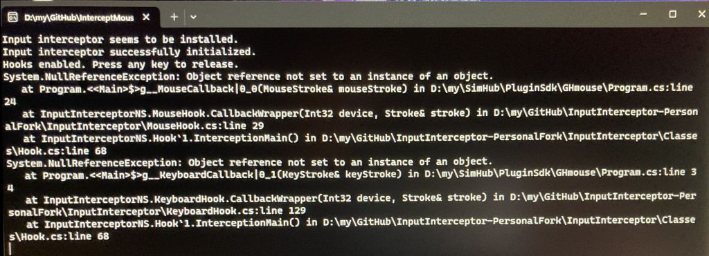

### Sample mouse interception code  
using [blekenbleu/InputInterceptor-PersonalFork](https://github.com/blekenbleu/InputInterceptor-PersonalFork)
 fork of [MP3Martin library](https://github.com/MP3Martin/InputInterceptor-PersonalFork/),  
which added bool return codes to @[0x2E757](https://github.com/0x2E757) [**InputInterceptor**](https://github.com/0x2E757/InputInterceptor/)  
...  which provided an [Example Application](https://github.com/0x2E757/InputInterceptor/#example-application)  
 &nbsp; &nbsp; &nbsp; and wrapped C# around Francisco Lopes' [**Interception** driver](https://www.oblita.com/interception.html)

This console app invokes `new MouseHook(MouseCallback);`,  
where `MouseCallback` writes `MouseStroke` members to the console until any keystroke is received.  

public struct [MouseStroke](MouseStroke.md) {
```
        public MouseState State;
        public MouseFlags Flags;

        public Int16 Rolling;		// ButtonData

        public Int32 X;
        public Int32 Y;

        public UInt32 Information;
	}

```
`stroke.Mouse` is the instance of [`MouseStroke`](https://github.com/blekenbleu/InputInterceptor-PersonalFork/blob/master/InputInterceptor/Classes/MouseStroke.cs)
 in [`InputInterceptor`](https://github.com/blekenbleu/InputInterceptor-PersonalFork/blob/master/InputInterceptor/InputInterceptor.cs) class,
- which [delegates](https://learn.microsoft.com/en-US/dotnet/csharp/programming-guide/delegates/)
  to [`DllWrapper`](https://github.com/blekenbleu/InputInterceptor-PersonalFork/blob/master/InputInterceptor/DllWrapper.cs) class,  
  - which wraps  [`InterceptionMethods`](https://github.com/blekenbleu/InputInterceptor-PersonalFork/blob/master/InputInterceptor/InterceptionMethods.cs) class methods,  
    - which declare C# interfaces to [**Interception**](https://www.oblita.com/interception.html) driver [C library functions](https://github.com/oblitum/Interception/blob/master/library/interception.c)  

### Other interception variables
`Context`:  returned by `InputInterceptor.CreateContext();` during `Hook()`.  
`Predicate`:&nbsp; sorts device[s] of interest in `Context`;&nbsp; typically `interception_is_mouse(device)`,  
  &nbsp; &nbsp; &nbsp; which is used e.g. when collecting `DeviceData` list of `Device` (Int32)  
  &nbsp; &nbsp; &nbsp; for up to 10 keyboard + 10 mouse devices better defined by `GetHardwareId(device)`  
`Device`:&nbsp; a number from `DeviceData` list, as discovered by Windows;&nbsp;  `1-10` for keyboards, `11-20` for mice.    
  &nbsp; &nbsp; &nbsp; Unplugging and replugging a USB mouse assigns it a new (higher) `Device` number.  
`InterceptionPrecedence`:  obtained by `interception_get_precedence()`  
 &nbsp; &nbsp; &nbsp; from `DeviceIoControl(device.handle, IOCTL_GET_PRECEDENCE,..)`;  
 &nbsp; &nbsp; &nbsp; relevant when multiple hooks contend for device events.  

### [`MouseCallback()`](blob/master/program.cs#L24)
 eventually gets called as `this.Callback()` in [`CallbackWrapper()`](https://github.com/blekenbleu/InputInterceptor-PersonalFork/blob/master/InputInterceptor/MouseHook.cs#L29)
 from [`InterceptionMain()`](https://github.com/blekenbleu/InputInterceptor-PersonalFork/blob/master/InputInterceptor/Classes/Hook.cs#L57)  
- Modified [`CallbackWrapper()`](https://github.com/blekenbleu/InputInterceptor-PersonalFork/blob/master/InputInterceptor/MouseHook.cs#L29) delegate to also pass `this.Context` and `this.Device` 

### [`GetHardwareId()`](https://github.com/blekenbleu/InputInterceptor-PersonalFork/blob/master/InputInterceptor/InterceptionMethods.cs#L47)
perhaps more consistently identifies hardware over time ... requiring `Context` as well as `Device`

*12 Nov 2023*  
`InterceptMouse.exe` runs OK in Visual Studio debugger, but crashed when invoked from Explorer:  
  
- `Hook.cs` line 68 is inside a `try{}`, where exceptions should be caught,  
	but `try{}` *does not propagate across delegates*, requiring `try{}` in callback instances.  
- `Program.cs` line 24 is a `Console.WriteLine()`  
	suggesting that something about `Console.WriteLine()` content in callback is problematic...  
	perhaps null member[s] in non-null `MouseStroke`...  

*16 Nov 2023*  
- Added `Context` to  [`CallbackWrapper()`](https://github.com/blekenbleu/InputInterceptor-PersonalFork/blob/master/InputInterceptor/MouseHook.cs#L29) delegates  
- Used `Context` to grab `static List<DeviceData> devices.Count`  
- **To Do**:
	- implement mouse scroll handling based on [MouseStroke](MouseStroke.md) and [evilC/AutoHotInterception](https://github.com/evilC/AutoHotInterception/blob/master/C%23/AutoHotInterception/Helpers/HelperFunctions.cs#L148)  
	- integrate with `MessageBox` branch of [WinForm](https://github.com/blekenbleu/WinForm)  
